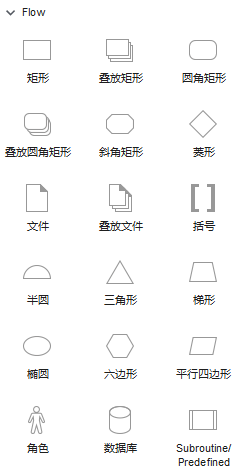

# za

#### 流程图中的图形标准含义
rectangle：矩形
作用：一般用作要执行的处理（process），在程序流程图中做执行框。在Axure中如果是画页面框架图，那么也可以指代一个页面。你可把页面和执行命令放在同一个流程中做说明，这个时候将两类不同的矩形做色彩区别，然后做说明就好了。

rounded rectangle：圆角矩形或者扁圆
作用：表示程序的开始或者结束，在程序流程图中用作为起始框或者结束框。

beveled rectangle：斜角矩形
作用：斜角矩形我几乎不使用，可以视情况自行定义。或者在其他的流程图中，有特殊含义，暂不知晓，也希望有识之士指点一二。

diamond：菱形
作用：表示决策或判断（例如：If…Then…Else）,在程序流程图中，用作判别框。

file：文件
作用：表达为一个文件，可以是生成的文件，或者是调用的文件。如何定义，需要自己根据实际情况做解释。

bracket：括弧
作用：注释或者说明，也可以做条件叙述。一般流程到一个位置，做一段执行说明，或者特殊行为时，我会用到它。

semicircle：半圆形
作用：半圆在使用中常作为流程页面跳转、流程跳转的标记。

triangle：三角形
作用：控制传递，一般和线条结合使用，画数据传递。

trapezoid：梯形
作用：一般用作手动操作。

ellipse：椭圆形或圆形
作用：如果画小圆，一般是用来表示按顺序数据的流程。如果是画椭圆形，很多人用作流程的结束。如果是在use case用例图中，椭圆就是一个用例了。

hexagon：六边形
作用：表示准备之意，大多数人用作流程的起始，类似起始框。

parallelogram：平行四边形
作用：一般表示数据，或确定的数据处理。或者表示资料输入（Input）。

actor：角色
作用：来自于use case 用例，模拟流程中执行操作的角色是谁。需要注意的时，角色并非一定是人，有时候是机器自动执行，有时候也可是模拟一个系统管理。

database：数据
作用：就是指保存我们网站数据的数据库。

image：图片
作用：表示一张图片，或者置入一个已经画好的图片、流程或者一个环境。